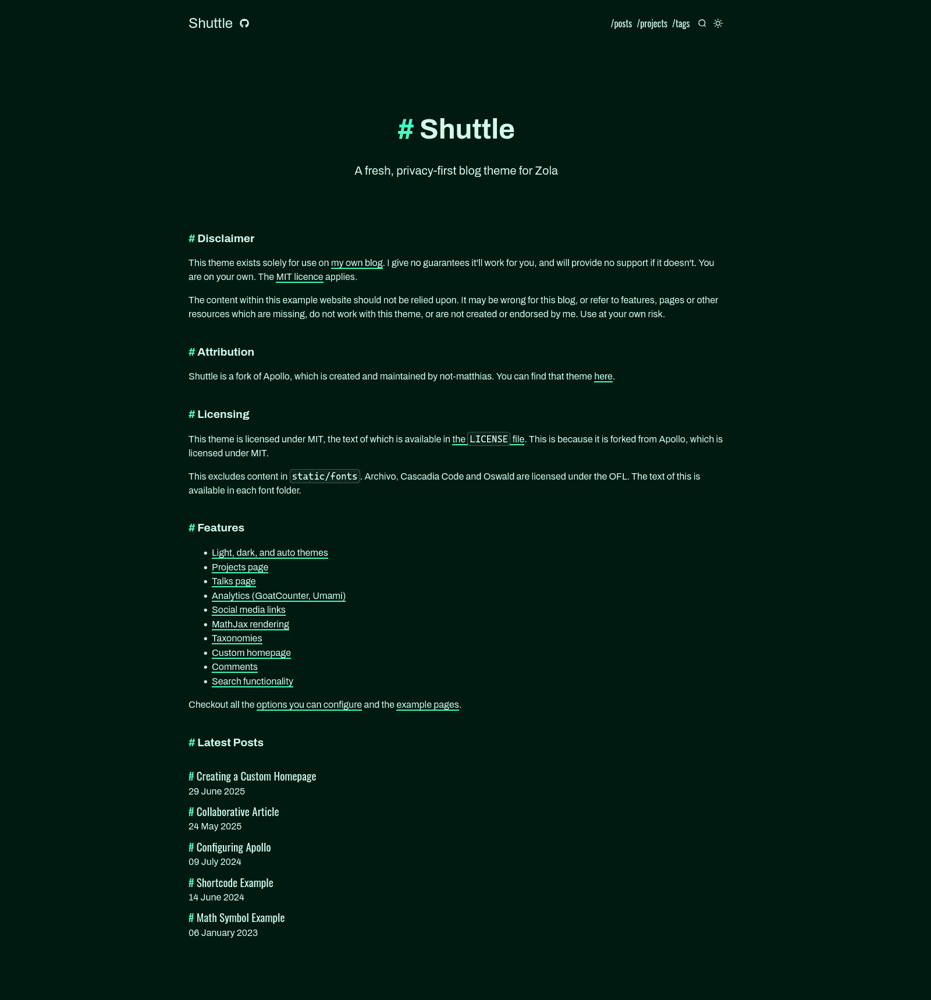
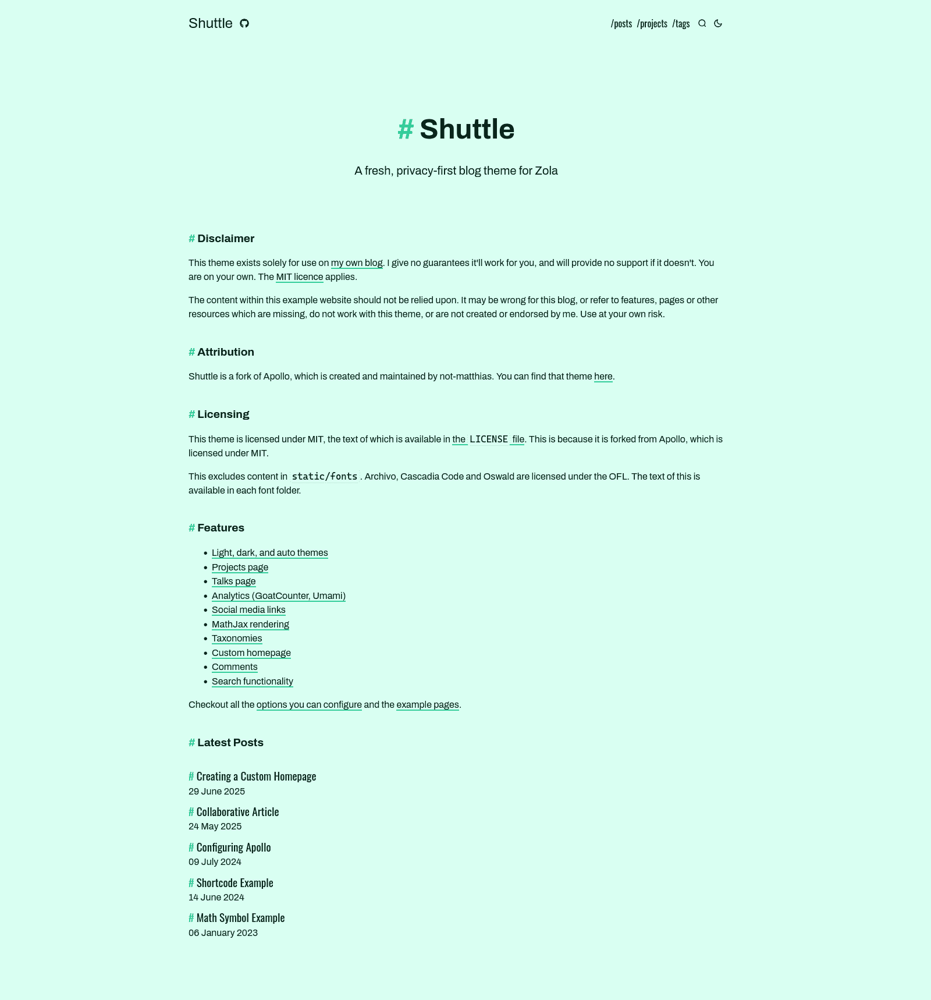

# Shuttle

Modern and minimalistic blog theme powered by [Zola](https://getzola.org). Forked from [Apollo](https://github.com/not-matthias/apollo), itself based on [archie-zola](https://github.com/XXXMrG/archie-zola/).

  
Dark theme

  
Light theme

## Features

- [x] Pagination
- [x] Themes (light, dark, auto)
- [x] Projects page
- [x] Analytics using [GoatCounter](https://www.goatcounter.com/) / [Umami](https://umami.is/) / [Google Analytics](https://analytics.google.com/)
- [x] Social Links
- [x] MathJax Rendering
- [x] Taxonomies
- [x] Meta Tags For Individual Pages
- [x] Custom homepage
- [x] Comments
- [x] Search
- [x] RSS feeds
- [x] Mermaid diagram support
- [x] Table of Contents
- [x] Configurable cards layout

## Installation

I've created this theme entirely for use on my own blog. I provide no guarantees it will work for you, nor any support if it doesn't.

If you would like to play around with this theme, the installation instructions on the [Apollo repository](https://github.com/not-matthias/apollo) upstream might help.

If you would like a theme with community support, I would recommend choosing something else.

## Configuration

Checkout all the [options you can configure](./content/posts/configuration.md) and the [example pages](./content/posts/).